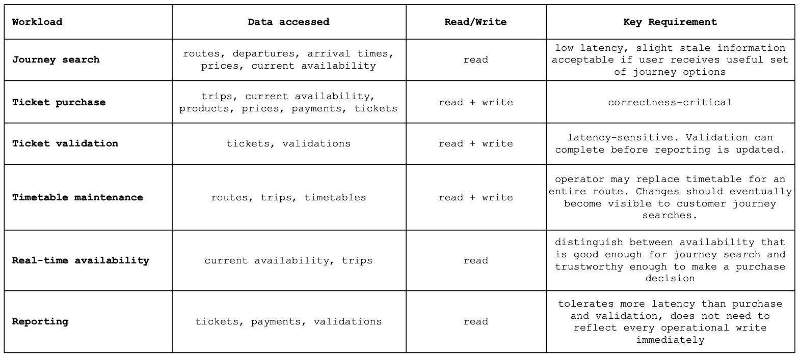
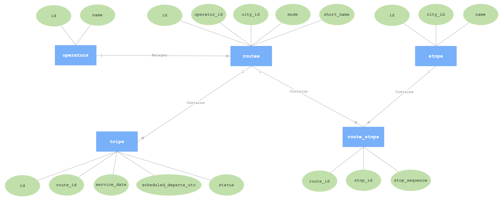
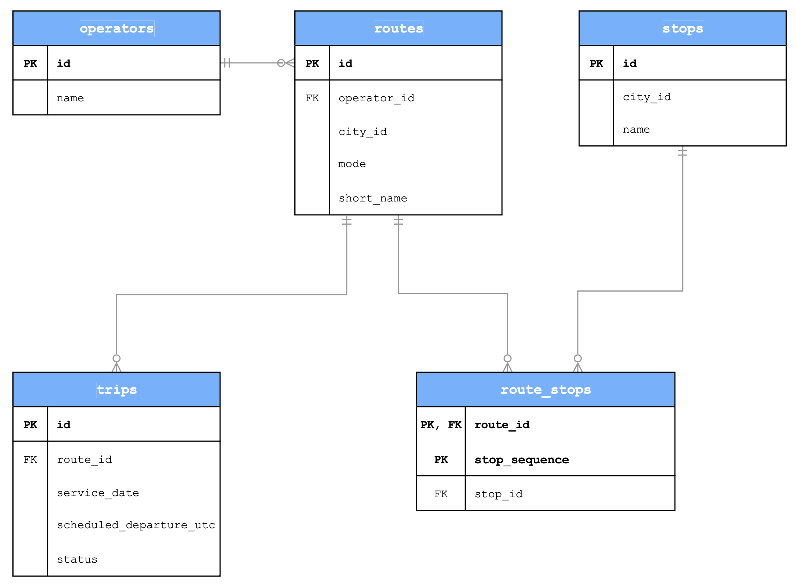
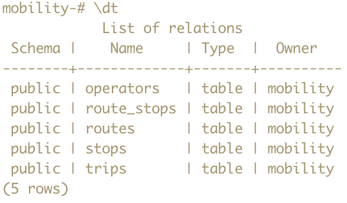
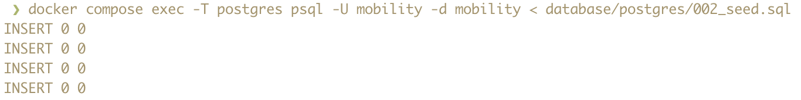
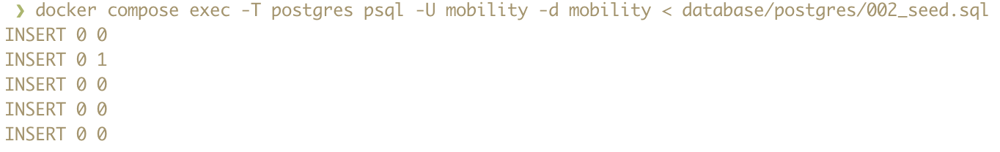
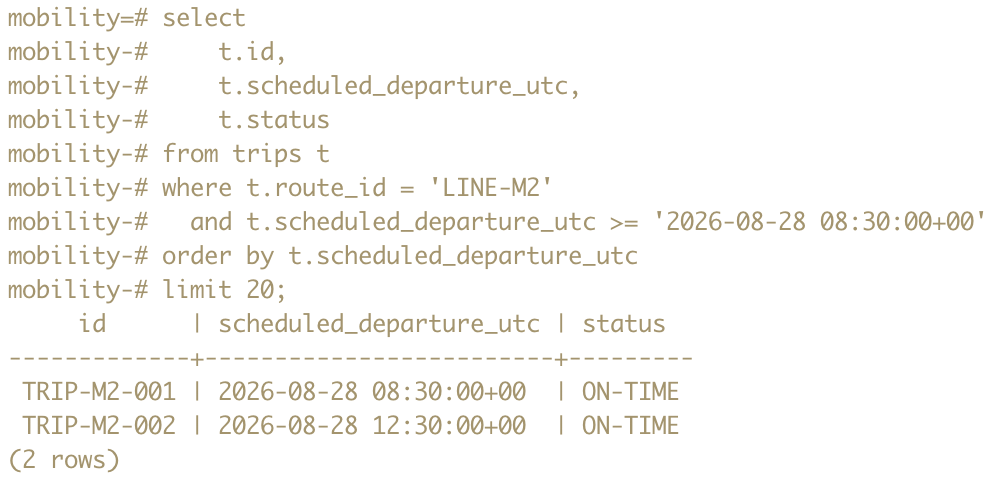
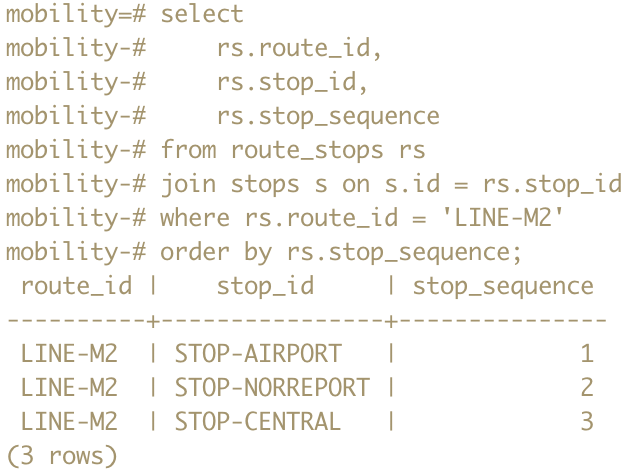
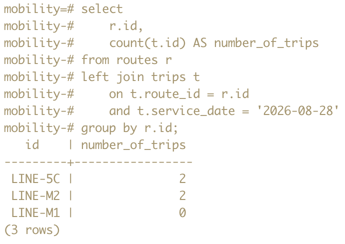

### Decide whether a route may visit the same stop more than once, and explain the choice
A route may visit the same stop more than once. Considering the relationship between trips and routes, one route can be a round trip, and might therefore include the same arrival station as the departure station.

### Decide the primary key of the route-stop relation and explain the decision
Due to the fact that a route may visit the same stop more than once, the primary key of the route-stop relation cannot be (route_id, stop_id). Therefore, the optimal primary key becomes (route_id, stop_sequence), which on the other hand ensures only one stop with that sequence exists along the route.

### Record one assumption that may change later
The fact that a stop may occur multiple times per route, still remains an assumption that might change later.

### Describe the customers, operators, and city transport context without naming a database product
The customers are passengers who use the platform to view and manage their public transport journeys. They can search for routes, view departures and delays, buy digital tickets, and validate their tickets when boarding.

The operators are responsible for maintaining the transport services available through the platform. They use it to manage routes and timetables, update products and prices, and view information about usage and revenue.

The platform operates in a city transport environment covering buses, trams, and trains. Important concepts within this environment include customers, operators, routes, stops, trips, products, tickets, payments, and validations. The environment requires low latency and up-to-date information, particularly due to rush-hour traffic and frequent real-time updates, while operations such as ticket purchases and validations are correctness-critical.

### Cover route search, ticket purchase, ticket validation, timetable updates, real-time availability, and reporting in the access-pattern map.

### Include identifiers, relationships, and cardinalities in the ER diagram

### Explain one functional dependency and what normalization prevents
A functional dependency in the trips table is id --> route_id, service_date, scheduled_departure_utc, and status. The id is the determinant, while route_id, service_date, scheduled_departure_utc, and status are dependent on it.

Normalization prevents route information, such as operator_id, city_id, and short_name, from being repeated for every trip, by storing this information once in routes and letting each trip reference its route through route_id.

### State what the implementation proves and what remains unknown
The implementation proves that the schema is applied correctly, seed data can be loaded more than once, and queries return the expected results. Performance with many database records remains unknown.

