# Dossier

### 1. Predict what will happen when trying to remove the old reference before updating the application code.
Dropping `tickets.product_code` will break the old reader/writer and we will lose the link between tickets and products.

### 1. Explain how you could lose the link between tickets and products.
If the values are removed before being mapped to `product_id`, we lose information about the existing relationship between tickets and products, which means the relationship can no longer be reconstructed from tickets alone.

### 1. Show which old query or insert breaks.
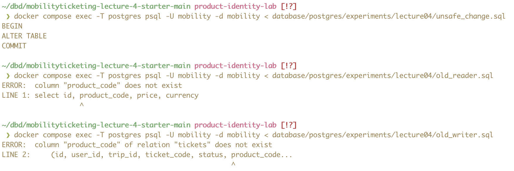

### 2. Explain what you would need to consider with a much larger table.  
With a much larger table, it's important that we avoid immediately scanning all existing rows when adding the new foreign key. Instead the migration should allow a gradual transition from the old reference to the new one. Backfilling all product ids immediately might also be undesirable for a large table, so it could instead be performed gradually in smaller batches, however this would require us to allow null until completed.

### 3. Write an insert and a query that use only `product_code`, as the old application would. Show that both still work after you add the new columns.
Using `old_reader.sql` and `old_writer.sql`:
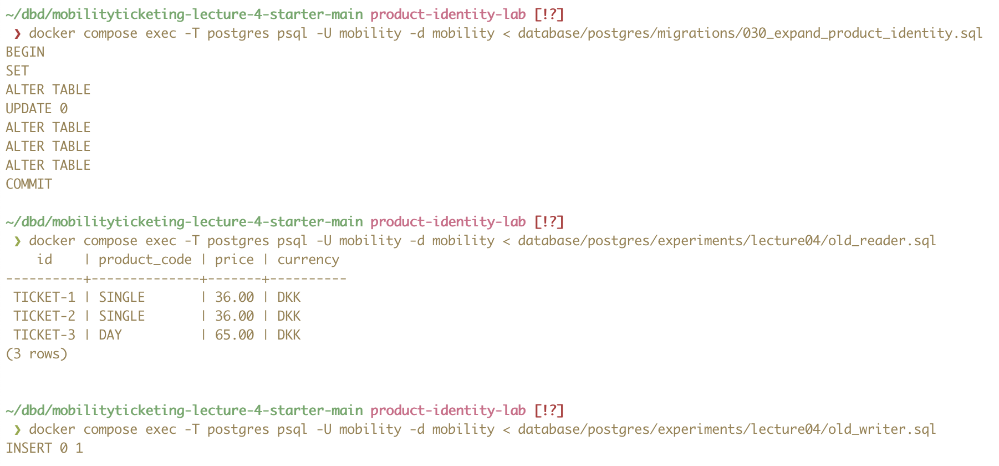

### 4. Test results
Test 1: Give a real product_id and verify that the inserted ticket gets both that id and the corresponding code. Also verify that the ticket gets the supplied price rather than the product's current catalogue price.


Test 2: Give a UUID that doesn't exist in products. Should insert 0 rows.
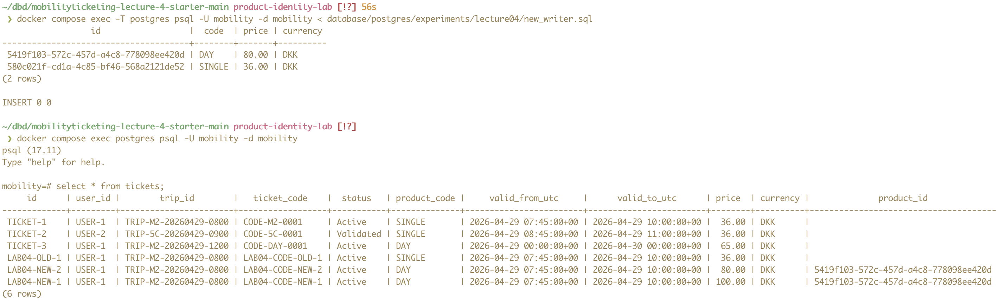

Test 3. Give a conflicting product id and product code. Should ignore product code.


### 5. Test results
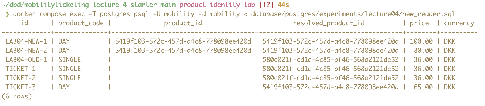

### 6. Test results
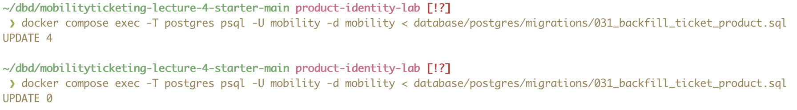

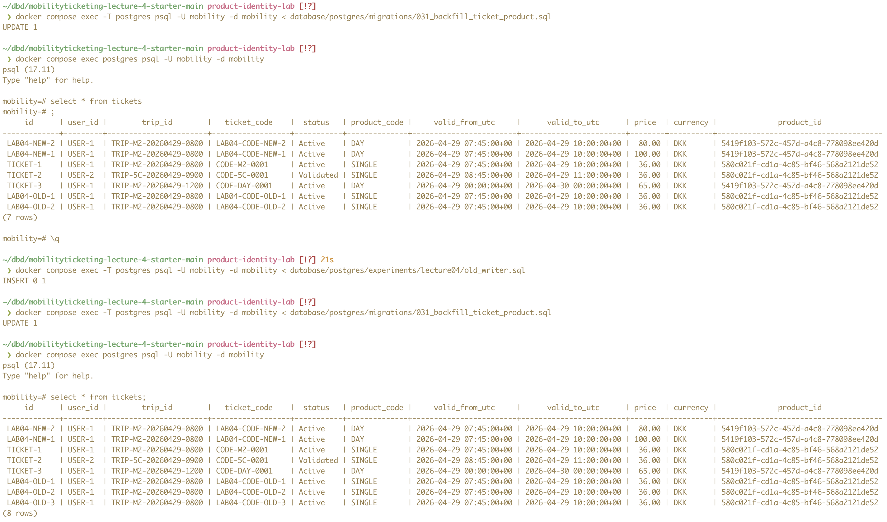

### 7. Compare the original tickets, prices and currencies with your starting data.
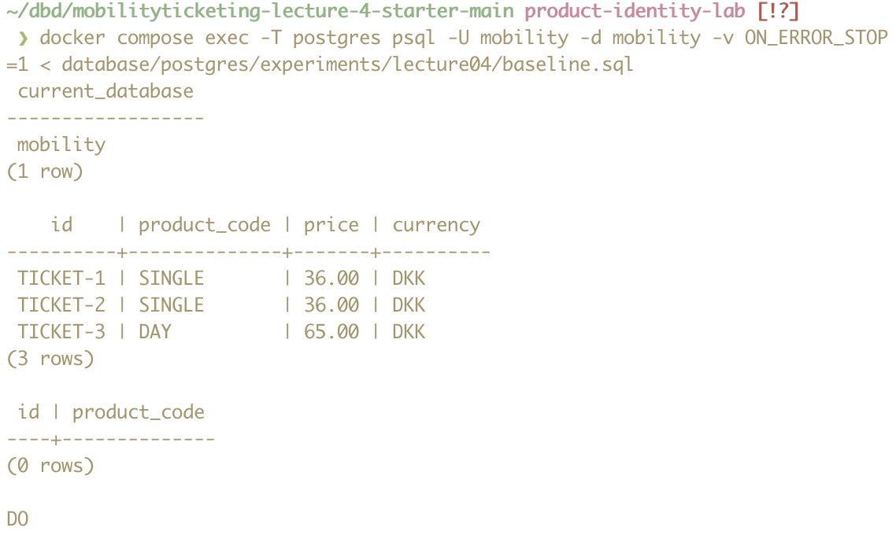

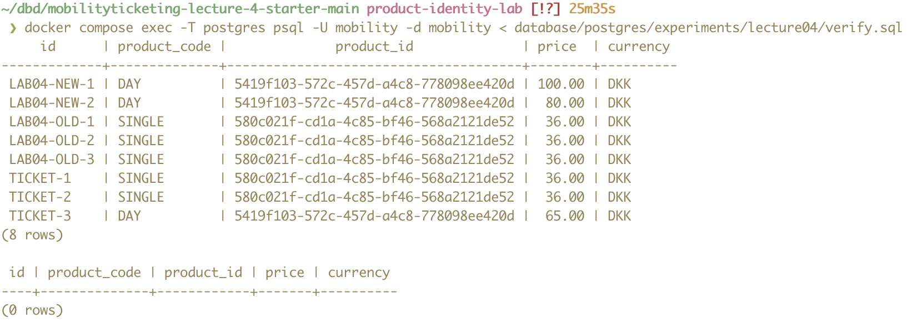

### 7. Try writing a mismatched pair directly in SQL and record whether the database rejects it.
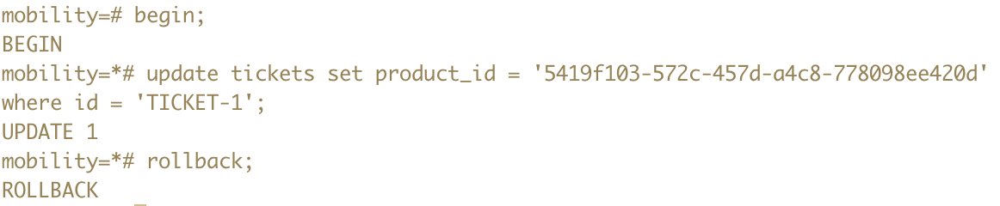

### 8. Test results
Test 1: Make `product_id` required while one ticket still has a null reference.
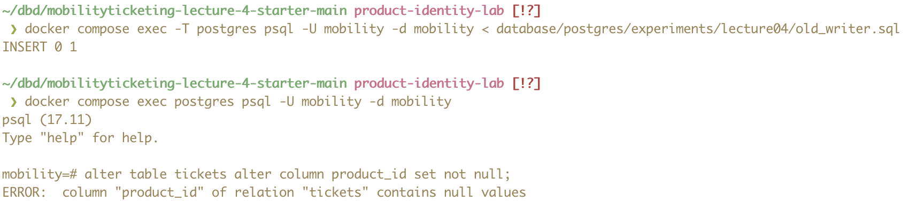

Test 2: Old writer fails after applying `032_require_ticket_product.sql`.
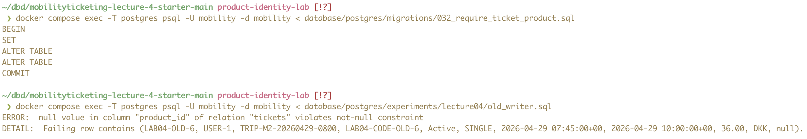

### 9. Test after removing the product code column from tickets
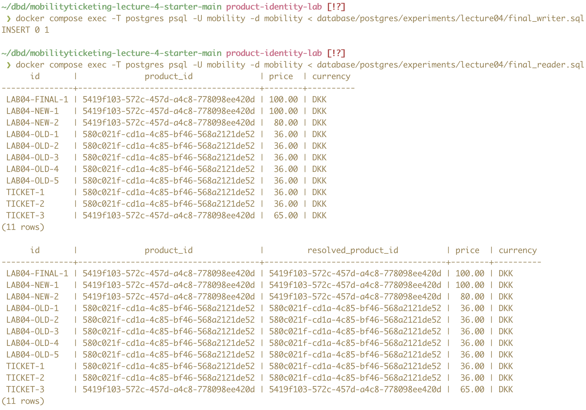

### Add a small table showing which inserts and queries work before expansion, after expansion, once the ID is required, and after the old column is removed. Note any query that runs but misses tickets.
| Operation | Before expansion | After expansion | ID required | Old column removed |
|---|---|---|---|---|
| Old writer | Works | Works | Fails because `product_id` is required | Fails because `tickets.product_code` no longer exists |
| New writer | Fails because `product_id` does not exist yet | Works | Works | Fails if it tries to write `tickets.product_code` |
| Final writer | Fails because `product_id` does not exist yet | Fails because `tickets.product_code` is `NOT NULL` | Fails because `tickets.product_code` is `NOT NULL` | Works |
| Old reader | Works | Works | Works | Fails because `tickets.product_code` no longer exists |
| New reader | Not applicable before `product_id` exists | Works | Works | Fails because it refers to `tickets.product_code` |
| Final reader | Fails because `product_id` does not exist yet | Runs, but misses tickets whose `product_id` is still null | Works | Works |

### When would you stop the old writers, and could you still return to the old application version? Support your answer with a result from your tests.
I would stop the old writers once all historical data has been backfilled and the new writers, readers, functions, stored procedures, views, and other dependencies have been updated and verified. Until `product_id` is made required, the database still supports the old writer, so it is possible to return to the old application version. After `product_id` is made `NOT NULL`, the old writer fails because it does not supply a product ID, so rolling back to the old application version would no longer be possible without also rolling back the database change. This is evident from the old writer working after expansion in section 3 and failing after `product_id` is made required in section 8.

### Moodle Step 8: EF Core migration comparison
The following example migration was generated using an AI tool for comparison with the SQL migrations:

#### Migration 1: Expand schema
```csharp
protected override void Up(MigrationBuilder migrationBuilder)
{
    migrationBuilder.AddColumn<Guid>(
        name: "id",
        table: "products",
        type: "uuid",
        nullable: true);

    migrationBuilder.Sql("""
        update products
        set id = gen_random_uuid()
        where id is null;
        """);

    migrationBuilder.AlterColumn<Guid>(
        name: "id",
        table: "products",
        type: "uuid",
        nullable: false,
        defaultValueSql: "gen_random_uuid()",
        oldClrType: typeof(Guid),
        oldType: "uuid",
        oldNullable: true);

    migrationBuilder.CreateIndex(
        name: "IX_products_id",
        table: "products",
        column: "id",
        unique: true);

    migrationBuilder.AddColumn<Guid>(
        name: "product_id",
        table: "tickets",
        type: "uuid",
        nullable: true);

    migrationBuilder.AddForeignKey(
        name: "FK_tickets_products_product_id",
        table: "tickets",
        column: "product_id",
        principalTable: "products",
        principalColumn: "id");
}
```

#### Migration 2: Backfill existing tickets

```csharp
protected override void Up(MigrationBuilder migrationBuilder)
{
    migrationBuilder.Sql("""
        update tickets t
        set product_id = p.id
        from products p
        where t.product_id is null
          and t.product_code = p.code;
        """);
}

```
#### Migration 3: Require product_id
```csharp
protected override void Up(MigrationBuilder migrationBuilder)
{
    migrationBuilder.AlterColumn<Guid>(
        name: "product_id",
        table: "tickets",
        type: "uuid",
        nullable: false,
        oldClrType: typeof(Guid),
        oldType: "uuid",
        oldNullable: true);
}
```

#### Migration 4: Remove old ticket reference

```csharp
protected override void Up(MigrationBuilder migrationBuilder)
{
    migrationBuilder.DropColumn(
        name: "product_code",
        table: "tickets");
}
```

#### Comparison
##### When product_id becomes nullable or required
In the manual migration in `030_expand_product_identity.sql`, `tickets.product_id` is nullable. This is also the case in the first EF Core migration. In the manual migration, it becomes non-nullable in `032_require_ticket_product.sql` only after all existing tickets have been backfilled and the foreign key has been validated. In the EF Core migrations, this happens in a later migration that alters `product_id` to `nullable: false`.  

The difference lies in the fact that the manual SQL explicitly validates the foreign key before making it required, while the EF Core migration only expresses the schema change itself, requiring the developer to determine when the change is safe based on the existing data and migration order.

##### Creation of the foreign key
In the manual migration in `030_expand_product_identity.sql`, the `tickets_product_id_fk` is created without immediate validation to allow for gradual backfill of values. Existing rows can therefore initially have a null `product_id` while they are being backfilled. Once the backfill has been performed, we validate the constraint in `032_require_ticket_product.sql`, ensuring that all non-null `product_id` values reference existing products, before using `not null` to ensure that every ticket has a `product_id`.  

The EF Core migration also allows `product_id` to be null at this stage, but creates the foreign key directly without `not valid`, meaning PostgreSQL checks the existing rows when the constraint is created. With the small amount of data in our database, this is unlikely to be an issue, however, with a much larger database, immediately validating all existing rows could make adding the constraint take longer and hold locks for longer. Using `not valid` allows the constraint to be added first and the validation of existing data to be performed separately at a more suitable point in the migration.

##### How existing rows are updated
In the manual migration in `031_backfill_ticket_product.sql`, the correct `product_id` is found for tickets where `product_id` is null by matching `tickets.product_code` with `products.code`. The EF Core migration performs the same backfill, however this is only because the developer has explicitly written the SQL using `migrationBuilder.Sql(...)`. EF Core cannot infer this backfill behaviour from the model alone.

##### Removal of product_code
In the manual migration, `tickets.product_code` is only removed after `tickets.product_id` has been validated and set to `not null`, ensuring that we no longer need the product code for the relationship between tickets and products. Before removing the column, we also inspect views and functions that use `tickets.product_code` and drop the column without `cascade`, so known database dependencies are not automatically removed.  

When the column is removed using the EF Core migration, these checks are not included. Therefore, if the dependencies and existing data are not properly inspected by the developer beforehand, removing the column could break code or database objects that still depend on it, or remove the information needed to migrate existing ticket-product relationships if the backfill has not already been completed.

##### Anything destructive
EF Core can generate destructive schema changes such as dropping `product_code`, but it cannot determine from the model alone whether the existing data has been safely migrated or whether old application code still depends on the column. The developer therefore needs to ensure that the required backfill, validation, and application changes have been completed before applying these changes. For example, dropping `tickets.product_code` before having established a new connection through `product_id` would permanently remove the relationship between tickets and products.  

Furthermore, if changes are applied to the database tables without updating code that depends on the old schema, the application can break.